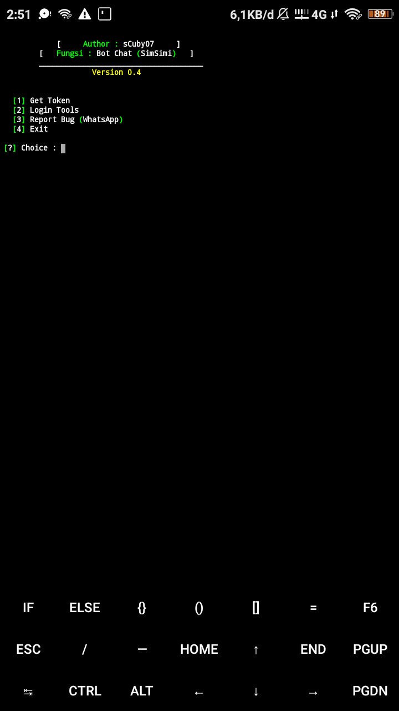

## Bot Chat
* [Instalation](#install)
* [Chat Admin](#chat)

## Instalation
```
$ apt-get update
$ apt install python
$ apt install git
$ pip install requests
$ python3 -m pip install requests
$ git clone https://github.com/anonkyuhuu/botchat
$ cd botchat
$ python3 main.py
```

## Chat Admin
Click [here](https://wa.me/62895611982226) To Chat Admin
